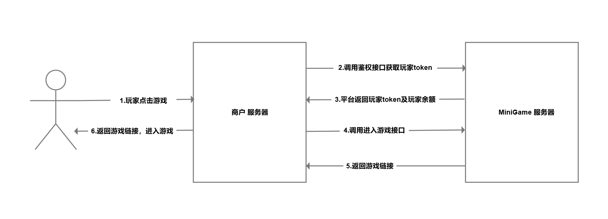

# 转账钱包

## 流程图 

## Request 参数 
接入方调用POLY平台所有API调用均需包含
**`POST`** `/`**`MINIGAME_APIURL`**`?trace_id=`**`your`**`_trace_id`

### Header 

| Name           | Value                                                      |
| -------------- | ---------------------------------------------------------- |
| `Content-Type` | "application/json; charset=utf-8"                          |
| `sign`         | "**your**\_sign\_string" |

签名算法请查阅 [签名算法及示例](#/kuai-su-kai-shi-jie-ru-shuo-ming-bi-kan#qian-ming-suan-fa-ji-shi-li) 页面描述

### Body 

| Name        | Type    | Description       |
| ----------- | ------- | ----------------- |
| `appid`     | string  | 商户的唯一标识,可通过商户后台获得 |
| `timestamp` | integer | 时间戳（秒）            |

***

## Response 参数 
当接入方返回的http code为200时，为HTTP访问API正常，可正常解析返回结果。其余http错误时为链路异常。
### Header 

| Name           | Value                             |
| -------------- | --------------------------------- |
| `Content-Type` | "application/json; charset=utf-8" |

### Body 

| 参数名  | 类型      | 说明                   |
| ---- | ------- | -------------------- |
| code | integer | 状态码 `code=1` 时表示调用成功 |
| msg  | string  | 提示信息                 |
| data | object  | 返回的数据                |

## 错误码 
更多返回错误代码请查阅 [通用错误码 ](#/kuai-su-kai-shi-tong-yong-cuo-wu-ma)页面描述